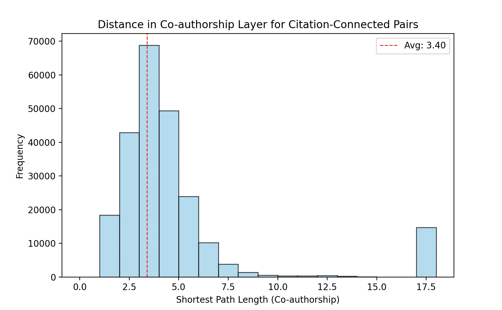
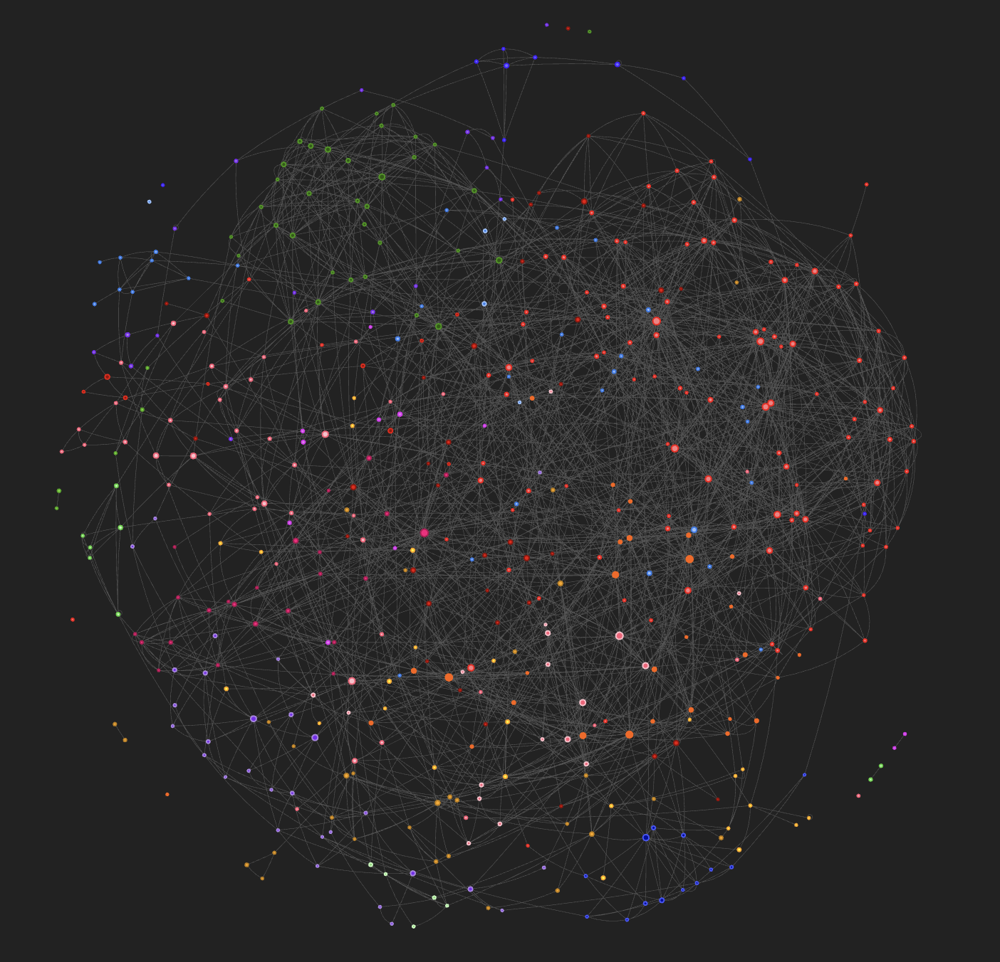

# HEP-TH Network Analysis: Topology of the Theoretical Physics Community
**Course:** Complex Networks (Module 2) - Physics of Complex Systems (Unibo)
**Author:** Ehsan Qoreishi

## 1. Project Overview
This project analyzes the **High Energy Physics (HEP-TH)** collaboration network using data from ArXiv (1993–2003). By modeling authors as nodes and collaborations as edges, we investigate the fundamental topological properties that drive scientific discovery.

The study focuses on identifying **Small-World** properties, **Scale-Free** behavior, and the semantic nature of **Community Structure** using Natural Language Processing (NLP).

---

## 2. Methodology & Data Cleaning
A critical step in this analysis was the purification of the raw dataset. The original data contained "ghost nodes"—affiliation strings (e.g., "CERN", "University of Pisa") masquerading as authors.

* **Custom NLP Parser:** I implemented a strict filtering pipeline to distinguish human names from institutions.
* **Impact:** The cleaning process removed **~4,000 artifacts** (40% of the original graph), reducing the network from 9,782 to **5,993 verified authors**. This ensured that the calculated metrics reflect real human social dynamics, not data noise.

---

## 3. Statistical Analysis & Results

### A. Small-World Properties (The Watts-Strogatz Indicator)
The network exhibits a massive **Small-World Coefficient ($\sigma$)**, confirming that the physics community is highly interconnected.

| Metric | Real Network (GCC) | Random Graph (Erdős-Rényi) | Interpretation |
| :--- | :--- | :--- | :--- |
| **Avg Clustering ($C$)** | **0.4280** | 0.0005 | **High Clustering:** If Scientist A collaborates with B and C, there is a 43% chance B and C also collaborate. |
| **Avg Path Length ($L$)** | **6.07** | 5.67 | **Short Paths:** Information spreads globally in just ~6 steps ("Six Degrees of Separation"). |
| **Sigma ($\sigma$)** | **806.84** | 1.0 | **Verdict:** $\sigma \gg 1$ confirms a robust Small-World architecture. |

### B. Scale-Free Structure (Hubs)
The degree distribution follows a clear **Power Law** ($P(k) \sim k^{-\gamma}$), classifying the network as **Scale-Free**.

* **The Hubs:** The network is held together by a few "super-connected" individuals.
    * **Top Collaborators:** S. Ferrara (52), C. Vafa (51).
    * **Top Cited:** E. Witten (~7,000 citations).
* **Visual Evidence:** The linear tail in the log-log plot below confirms the power-law behavior.


*(Figure 1: Log-Log plot of author degrees showing Scale-Free tail)*

### C. Community Structure & Hierarchy
Using the **Louvain Algorithm**, we detected **455 distinct communities**. The size distribution reveals a strict hierarchy:

1.  **Macro-Communities (The "Big 5"):** A small core of ~15 groups contains >100 members each.
    * *Example:* Community 1 (Size 359) corresponds to the **String Theory/Branes** core (verified via TF-IDF keyword extraction).
2.  **Micro-Communities:** The distribution is heavily skewed; **368 communities (80%)** have fewer than 5 members. This reflects the reality of academic research: a few massive paradigm-defining schools surrounded by hundreds of isolated, niche research groups.


*(Figure 2: Histogram of Community Sizes showing the hierarchical structure)*

### D. Cross-Layer Dynamics (Social vs. Information Flow)
We analyzed the social distance between papers that cite each other.
* **Socially Embedded:** The peak at **3-4 steps** shows that most citations happen between socially connected authors.
* **The "Discovery Spike":** The anomalous bar at **$x \approx 14$** represents citations crossing between disconnected social components. These are the "long-range bridges" where scientific ideas jump across socially isolated sub-fields.


---

## 4. Conclusion
The HEP collaboration network is a robust **Small-World ($\sigma \approx 800$)** and **Scale-Free** system. The analysis proves that while the community is socially fragmented into hundreds of small groups, it remains globally connected through a few "super-hub" authors and shared semantic interests, allowing for rapid information propagation across the discipline.

## Visualizations

### 1. Cross-Layer Social Distance
This histogram shows the shortest path length in the Co-authorship graph for every pair of authors connected in the Citation graph. The average distance is **3.40**, suggesting that influence in HEP-Th spreads through relatively tight social circles.


*(Figure: Distribution of shortest path lengths between citing authors. Dashed line represents the mean.)*

### 1. Interactive Network Visualization
Click the image below to explore the interactive graph (zoom, pan, and hover over nodes to see connections):

[](https://EhsanQoreishi.github.io/hep-network-analysis/hep_network_interactive.html)
*(Note: This links to a live HTML page hosted on GitHub Pages. Requires a modern web browser.)*

## Usage
1.  Install dependencies:
    ```bash
    pip install -r requirements.txt
    ```
2.  Run analysis:
    ```bash
    python src/analysis.py
    ```