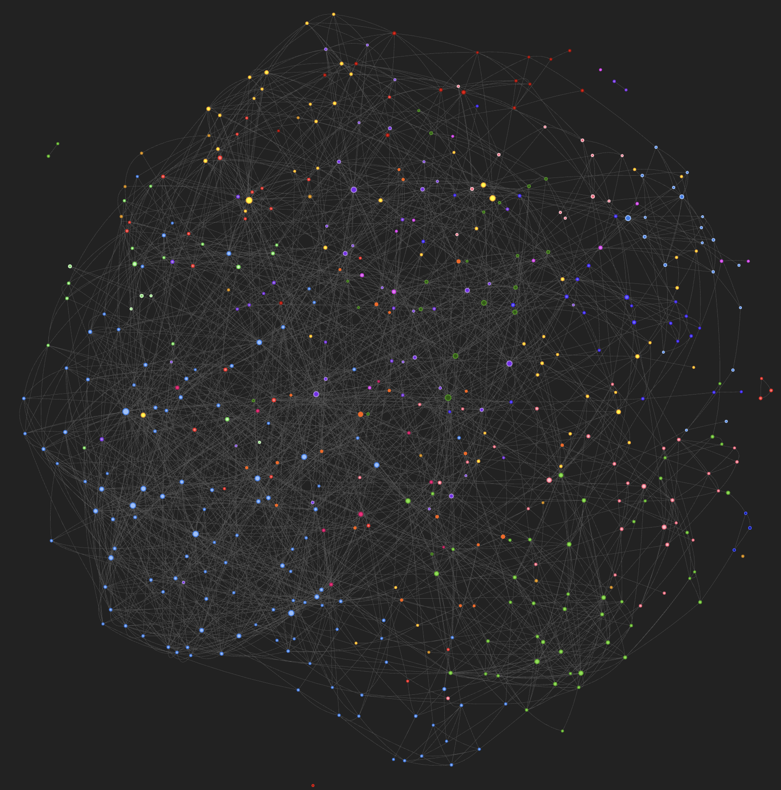

# High-Energy Physics Network Analysis (HEP-Th)

A computational physics project analyzing the structure, dynamics, and social properties of the ArXiv High-Energy Physics Theory (HEP-Th) citation network.

This project implements a reproducible pipeline to Extract, Transform, and Load (ETL) raw arXiv data, construct multi-layer networks (citation and co-authorship), and apply statistical mechanics metrics (Power Laws, Spectral Entropy) to understand scientific collaboration.

## 🕸️ Network Visualization

Below is a preview of the **Giant Component** of the co-authorship network.
*(Click the image to open the full interactive visualization if hosted)*

[](https://EhsanQoreishi.github.io/hep-network-analysis/results/interactive_map.html)


## 🚀 Features

* **Data Parsing**: Custom ETL pipeline to parse unstructured `.abs` abstract files and edge lists.
* **Network Construction**: Builds both **Citation** (Directed) and **Co-authorship** (Undirected/Weighted) graphs.
* **Physics Analysis**:
    * **Scale-Free Dynamics**: Statistical fitting of degree distributions to Power Law ($P(k) \sim k^{-\gamma}$).
    * **Spectral Properties**: Computation of Von Neumann Entropy and Algebraic Connectivity ($\lambda_2$) using the Graph Laplacian.
    * **Robustness**: Simulation of random failures vs. targeted attacks (percolation theory).
* **Automation**: Full workflow managed by **Snakemake**.

## 📂 Project Structure

    .
    ├── data/                   # Raw datasets
    ├── logs/                   # Execution logs
    ├── results/                # Generated scientific outputs
    ├── src/                    # Source code modules
    │   ├── analysis/           # Physics & Topology logic
    │   │   ├── communities.py  # Louvain community detection
    │   │   ├── physics.py      # Power laws & Robustness
    │   │   └── structural.py   # Centrality & Path metrics
    │   ├── constants.py        # Project-wide constants
    │   ├── networks.py         # Graph construction logic
    │   ├── preprocessing.py    # ETL & Text cleaning
    │   └── visualization.py    # Plotting & PyVis generation
    ├── tests/                  # Pytest suite
    ├── environment.yml         # Conda environment definition
    ├── main.py                 # CLI entry point
    └── Snakefile               # Automated workflow pipeline

## 🛠️ Installation

This project uses **Conda** for environment management and is optimized for Apple Silicon (M1/M2/M3) and standard architectures.

1.  **Clone the repository:**
    ```bash
    git clone https://github.com/EhsanQoreishi/hep-network-analysis.git
    cd hep-network-analysis
    ```

2.  **Create the environment:**
    ```bash
    conda env create -f environment.yml
    ```

3.  **Activate the environment:**
    ```bash
    conda activate hep_network_analysis
    ```

## 📊 Usage

### Automated Pipeline (Recommended)
This project uses **Snakemake** to automate the entire analysis. It checks for file changes and only runs necessary steps.

```bash
snakemake -c1
```
* `-c1`: Uses 1 CPU core. Increase this (e.g., `-c4`) for parallel execution.

### Manual Execution (CLI)
You can also run the script manually with custom arguments:

```bash
python main.py --data data/cit-HepTh.txt --abstracts data/cit-HepTh-abstracts --output results/
```

## ✅ Testing

Strict software engineering standards are enforced using `pytest`. The suite covers data cleaning logic, network integrity, and physics calculations.

To run the tests:
```bash
pytest tests/  
```

## 🔬 Scientific Results & Interpretation

The automated pipeline generated the following physics analysis, validated by the study of the Hep-Th community:

### 1. Scale-Free Topology (`social_layer_power_law_fit.png`)
The degree distribution $P(k)$ of the social layer exhibits a heavy-tailed nature that follows a power-law-like decay.
* **Observation**: The Power Law fit effectively captures high-degree hubs, while a Log-Normal fit provides a strong approximation for the mid-range degrees.
* **Parameters**: The Power Law alpha is recorded at **2.9325** with a cutoff ($x_{min}$) of **9.0**.
* **Implication**: A small fraction of "super-star" authors hold the majority of the network's influence, while the vast majority of researchers possess fewer than 10 connections.


### 2. Network Robustness & Percolation (`network_robustness.png`)
Percolation analysis highlights a distinct vulnerability in the community's architecture:
* **Random Failures**: The network is highly resilient; even when 20% of the nodes ($f=0.200$) are removed at random, the Giant Component Size ($S$) remains above **0.7**.
* **Targeted Attacks**: The community is significantly more vulnerable to attacks on high-degree hubs. Removing the top 20% of the most connected authors (such as high-impact leaders like Witten or Vafa) causes the Giant Component to collapse to approximately **0.2**.


### 3. Spectral Properties (`spectral_density_entropy.png`)
The spectral analysis of the normalized Laplacian matrix characterizes the network's information content:
* **Algebraic Connectivity ($\lambda_2$)**: The value is **0.009580**, serving as a measure of the network's structural organization.
* **Entropy**: The **Von Neumann Entropy ($S$)** is **4.50**. This is significantly lower than the maximum possible entropy ($S_{max} \approx 8.45$), indicating that the Hep-Th network is far from a random state and possesses a high degree of order.


### 4. Community Structure (`interactive_map.html`)
The network exhibits an exceptionally well-defined partitioning into distinct research clusters.
* **Louvain Algorithm**: This achieved a high average modularity of $Q = 0.7732$, where a value above 0.3 typically indicates significant community structure.
* **Stability Analysis**: The stability was confirmed by an Average Adjusted Rand Index (ARI) of **0.6191**, indicating the community structure is highly robust across different computational runs.
* **Semantic Validation**: Topological clusters were mapped to specific sub-fields using keyword metadata. For example, **Community 4** represents core theorists (keywords: quivers, mssm), while **Community 1** represents Mathematical Physics and Statistical Mechanics (keywords: ramanujan, spinon).
* **Small-World Properties**: The network features a high Average Clustering Coefficient of **0.4370** and an Average Path Length of **4.82**, ensuring information can flow rapidly through a dense web of local collaborations.

## 📚 Data Source

* **Citation Network**: [SNAP: ArXiv HEP-TH](https://snap.stanford.edu/data/cit-HepTh.html)
